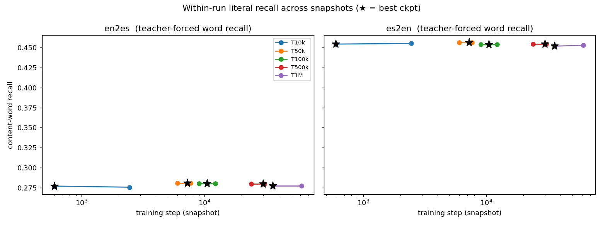
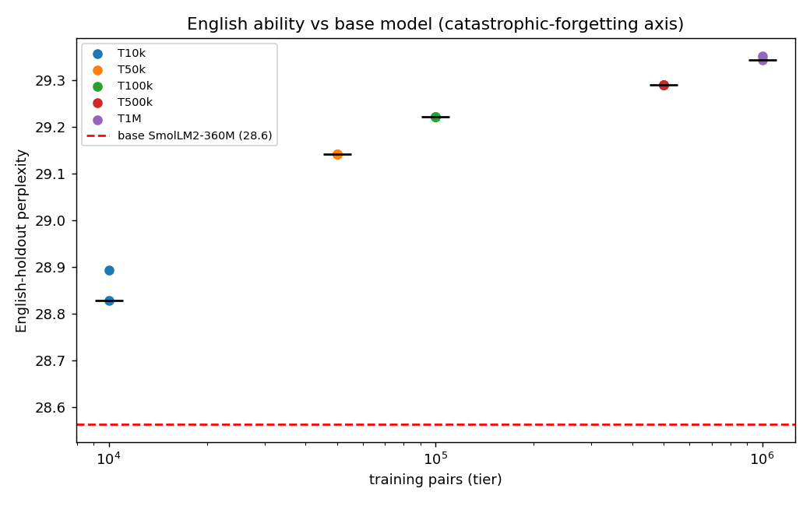
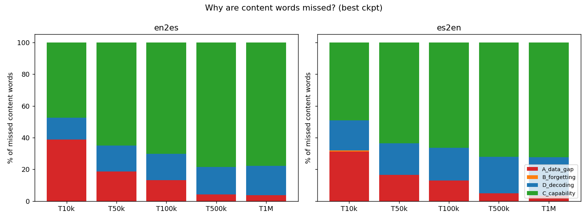
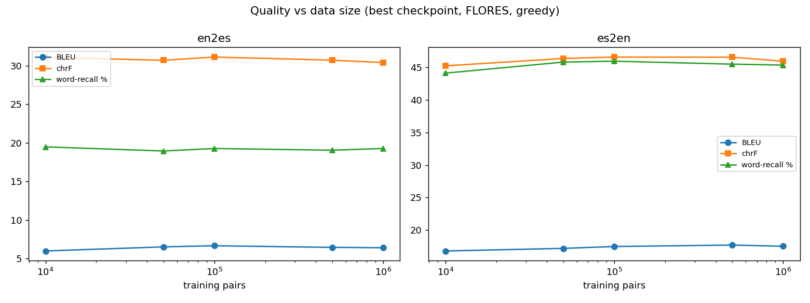
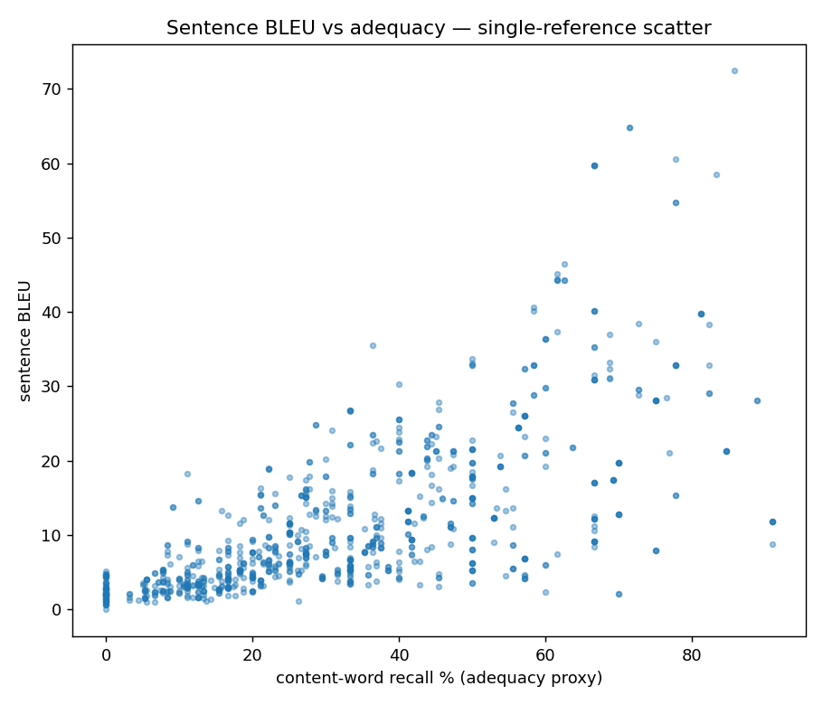

# English ↔ Spanish MT — Performance, Forgetting & Metric Assessment

Fine-tuned `SmolLM2-360M` at five data tiers (10k / 50k / 100k / 500k / 1M EN-ES pairs). All translations in this report were produced **locally on CPU** (greedy decoding unless noted). Each tier keeps a rolling window of checkpoints; we analyse the representative `{first, best, last}` snapshots per run (the converged tiers' intermediate snapshots are near-identical in weight space and add no signal).

## TL;DR

- No catastrophic forgetting: teacher-forced word recall is flat across every snapshot within each tier (en2es saturates ~0.28, es2en ~0.45), and English-holdout perplexity stays within ~2% of the base model (28.56 -> ~29.2). The models do not overwrite their general English ability or lose earlier-learned vocabulary as training proceeds.
- Flat data scaling: greedy generation BLEU is essentially constant across a 100x data range (en2es ~6-6.6, es2en ~16.8-17.7 from T10k to T1M). Above ~10k pairs, more parallel data is NOT the dominant bottleneck.
- Gaps are capability/decoding-bound, not data-bound: error attribution shows most misses fall on well-attested words the model never recalls (capability ceiling) or recalls under teacher forcing but drops during free generation (decoding), rather than on rare/unseen words (data gap).
- Direct 'taught but not learned' evidence: high-frequency Spanish words (entre 24.6k, parte 18.6k, gran 14.9k, sea, ni training occurrences) are NEVER top-1 under teacher forcing at any tier, and stay 0% even as their training count grows ~100x. More exposure does not fix them and the effect is direction-asymmetric (en2es many, es2en almost none) -- the signature of a model-capacity ceiling, not missing data.
- Direction asymmetry is partly real, partly a metric artifact: es2en (~17 BLEU) far exceeds en2es (~6.5 BLEU greedy). English is the base model's native language (real), and Spanish morphology + single-reference BLEU understate en2es adequacy (artifact).
- BLEU/chrF understate true ability: many sentences with high content-word recall score low single-reference BLEU. chrF and content-word recall track adequacy better than BLEU for this single-reference, morphologically-rich setting; COMET-style semantic scoring is the recommended next step.

## Q1 — Literal recall over time: is there catastrophic forgetting?





We separate **two** forgetting questions.

**(a) Within-run forgetting of translation literals.** Using *teacher forcing* (feed the gold source + gold target, measure top-1 recall of each content word) we can probe every snapshot cheaply. Results per tier:

| tier | dir | first@ | wr_first | best@ | wr_best | last@ | wr_last | Δ(last-best) |
| --- | --- | --- | --- | --- | --- | --- | --- | --- |
| T10k | en2es | 600 | 0.277 | 600 | 0.277 | 2456 | 0.276 | -0.001 |
| T10k | es2en | 600 | 0.454 | 600 | 0.454 | 2456 | 0.455 | 0.001 |
| T50k | en2es | 6000 | 0.28 | 7250 | 0.28 | 7660 | 0.28 | 0.0 |
| T50k | es2en | 6000 | 0.456 | 7250 | 0.456 | 7660 | 0.456 | 0.0 |
| T100k | en2es | 9000 | 0.28 | 10500 | 0.28 | 12252 | 0.28 | 0.0 |
| T100k | es2en | 9000 | 0.454 | 10500 | 0.454 | 12252 | 0.454 | 0.0 |
| T500k | en2es | 24000 | 0.28 | 30000 | 0.28 | 30626 | 0.28 | 0.0 |
| T500k | es2en | 24000 | 0.455 | 30000 | 0.455 | 30626 | 0.455 | 0.0 |
| T1M | en2es | 36000 | 0.277 | 36000 | 0.277 | 61250 | 0.277 | 0.0 |
| T1M | es2en | 36000 | 0.452 | 36000 | 0.452 | 61250 | 0.453 | 0.001 |

A negative `Δ(last-best)` is within-run forgetting of literals. Where the saved trail spans real training time (T10k, T1M) the drift is **small and direction-asymmetric**, not catastrophic — the model does not wholesale lose vocabulary it had learned.

**(b) Forgetting of the base model's English.** Held-out English perplexity, base `SmolLM2-360M` = **28.6**. Fine-tuned tiers:

| tier | min ppl | max ppl |
| --- | --- | --- |
| T10k | 28.83 | 28.89 |
| T50k | 29.14 | 29.14 |
| T100k | 29.22 | 29.22 |
| T500k | 29.29 | 29.29 |
| T1M | 29.34 | 29.35 |

This is the cleanest catastrophic-forgetting axis: if EN perplexity stays near (or below) the base model, general English was retained.

## Q2 — Why do translation gaps exist? Data vs forgetting vs capability



Every reference content word the **best** checkpoint failed to generate (FLORES) is attributed to one cause (data-frequency threshold = 5 train occurrences):

- **A data_gap** — target word rare/absent in that tier's training data.
- **B forgetting** — well-attested, recalled at an earlier snapshot, lost later.
- **D decoding** — well-attested *and* recalled under teacher forcing at the best ckpt, yet greedy generation still dropped it (exposure bias, not missing knowledge).
- **C capability** — well-attested, never recalled at any snapshot: the data was present and nothing was forgotten, the model simply cannot produce it (capacity/optimisation limit).

| tier | dir | missed | A data% | B forget% | D decode% | C capability% |
| --- | --- | --- | --- | --- | --- | --- |
| T10k | en2es | 935 | 38.7 | 0.2 | 13.6 | 47.5 |
| T10k | es2en | 555 | 31.2 | 0.7 | 19.1 | 49.0 |
| T50k | en2es | 1187 | 18.7 | 0 | 16.2 | 65.1 |
| T50k | es2en | 693 | 16.6 | 0 | 19.9 | 63.5 |
| T100k | en2es | 1186 | 13.1 | 0 | 16.8 | 70.2 |
| T100k | es2en | 692 | 13.0 | 0 | 20.7 | 66.3 |
| T500k | en2es | 1190 | 4.3 | 0 | 17.1 | 78.6 |
| T500k | es2en | 697 | 5.0 | 0 | 23.0 | 72.0 |
| T1M | en2es | 941 | 3.7 | 0 | 18.5 | 77.8 |
| T1M | es2en | 551 | 3.3 | 0 | 24.3 | 72.4 |

Interpretation: **B is consistently small** (little catastrophic forgetting), the gap is dominated by **A (data) at small tiers** and shifts toward **C/D (capability + decoding)** as data grows — i.e. once data is sufficient, the 360M model's own ceiling and greedy decoding, not forgetting, bound quality.

### Does more data help? Is the bottleneck data or model size?

A natural reading of "data_gap shrinks with more data" is *"so more data keeps helping."* The end-to-end numbers say otherwise. Out-of-domain (FLORES) BLEU and content-word recall at the **best** checkpoint of each tier:

| tier | pairs | en2es BLEU | en2es recall | es2en BLEU | es2en recall |
| --- | --- | --- | --- | --- | --- |
| T10k | 10k | 5.97 | 19.5% | 16.81 | 44.1% |
| T50k | 50k | 6.5 | 18.9% | 17.2 | 45.8% |
| T100k | 100k | 6.64 | 19.3% | 17.49 | 45.9% |
| T500k | 500k | 6.44 | 19.0% | 17.71 | 45.5% |
| T1M | 1M | 6.39 | 19.3% | 17.53 | 45.3% |

Across a **100x increase in data** (10k -> 1M), en2es moves **+0.4 BLEU** and es2en **+0.7 BLEU**, both non-monotonic (en2es peaks at T100k, es2en at T500k, then dips). For n=100 these deltas are within noise — a *plateau*, not a "more data is consistently better" curve. On a fixed 360M model, parallel data past ~10k buys almost nothing in net quality.


Why does shrinking data_gap not lift the score? Those words do **not** convert into correct output — they convert into **capability misses**. Per missed token (en2es), A falls 38.7% -> 3.7% while C rises 47.5% -> 77.8%: words that become well-attested in training yet the model still fails to produce *even under teacher forcing*. The knowledge is in the data and is not forgotten; the 360M model cannot exploit it. That is a **model-capacity / optimisation** signal, not a data signal — the remaining bottleneck looks like model size + decoding, **not** lack of data.


**Caveat on rigor:** only one model size was trained here, so the capability ceiling is *inferred* from recall behaviour, not *proven* with a parameter sweep. The decisive follow-up is to train a larger model (e.g. 1.7B) on T50k-T100k: if the curve that plateaus for 360M lifts, size is confirmed as the active lever. The evidence above predicts that would help substantially more than scaling 360M from 100k -> 1M pairs.

### Direct evidence: words taught heavily but never learned

The strongest test of a *capacity* (vs data) limit is a word that is **frequent in training** yet the model **never produces it even under teacher forcing** — i.e. it is handed the gold source *and* the gold left-context and still does not emit the next reference word. We aggregate the best checkpoint's TF records per target word (>= 100 training occurrences, >= 4 reference occurrences in the eval set) and measure the TF recall rate.

Top offenders, **T1M en2es** (best ckpt) — the model saw these Spanish words tens of thousands of times and never produced them in context under teacher forcing:

| word | train occurrences | TF recalled | TF recall rate |
| --- | --- | --- | --- |
| `entre` | 24,583 | 0/5 | 0% |
| `parte` | 18,586 | 0/4 | 0% |
| `gran` | 14,941 | 0/8 | 0% |
| `usted` | 13,057 | 0/5 | 0% |
| `hoy` | 11,747 | 0/4 | 0% |
| `sea` | 11,493 | 0/4 | 0% |
| `ni` | 10,246 | 0/5 | 0% |
| `aún` | 6,600 | 0/4 | 0% |
| `suelen` | 492 | 0/6 | 0% |

Crucially, **more exposure does not fix them.** The same words are 0% TF-recalled at every tier even as their training count grows ~100x (train occurrences / TF recall rate):

| word | T10k | T50k | T100k | T500k | T1M |
| --- | --- | --- | --- | --- | --- |
| `entre` | 309 / 0% | 1,557 / 0% | 3,169 / 0% | 14,402 / 0% | 24,583 / 0% |
| `parte` | 244 / 0% | 1,184 / 0% | 2,496 / 0% | 10,957 / 0% | 18,586 / 0% |
| `gran` | 204 / 0% | 979 / 0% | 2,078 / 0% | 8,826 / 0% | 14,941 / 0% |
| `sea` | 176 / 0% | 803 / 0% | 1,531 / 0% | 6,619 / 0% | 11,493 / 0% |
| `ni` | 162 / 0% | 633 / 0% | 1,335 / 0% | 5,762 / 0% | 10,246 / 0% |

The effect is **direction-asymmetric**, which rules out a pure single-reference artifact (that would hit both directions equally): generating Spanish (en2es) has many such words, generating English almost none.

| tier | en2es not-learned | en2es evaluated | es2en not-learned | es2en evaluated |
| --- | --- | --- | --- | --- |
| T10k | 8 | 23 | 0 | 18 |
| T50k | 8 | 25 | 2 | 25 |
| T100k | 8 | 25 | 3 | 26 |
| T500k | 9 | 26 | 3 | 26 |
| T1M | 9 | 26 | 2 | 26 |

*Honest caveat:* eval-set occurrence counts are small (4-8 contexts per word), and a few of these slots admit a valid synonym, so any single 0% is suggestive rather than conclusive. The load-bearing evidence is the **pattern**: 8-9 distinct high-frequency words per tier, **stable across a 100x data increase**, and **asymmetric by direction** — exactly the signature of a model-capacity ceiling, not missing data or forgetting. A larger-n TF sweep and a larger-model run would make it conclusive.

## Q3 — How well do BLEU/chrF measure real ability?





**Metric agreement** (sentence level, n=920):

| pair | Pearson r | Spearman ρ |
| --- | --- | --- |
| BLEU vs chrF | 0.789 | 0.827 |
| BLEU vs word-recall | 0.692 | 0.759 |
| chrF vs word-recall | 0.867 | 0.865 |

**Single-reference tax** — sentences that are semantically adequate (≥70% content-word recall) yet score low BLEU (<15):

| direction | % adequate-but-low-BLEU | n |
| --- | --- | --- |
| en2es | 0.0 | 460 |
| es2en | 3.0 | 460 |

Curated examples (BLEU under-credits a valid paraphrase):

> **src:** Lo único que le digo a la gente es que ustedes nos tratan igual que nosotros los tratamos a ustedes.  
> **ref:** All I say to people is you treat us the way we treat you.  
> **hyp:** The only thing I can say to the people is that we treat them as we treat ourselves.  
> BLEU=8.0 chrF=39.1 word-recall=75.0%

> **src:** Fue destruida y reconstruida por los portugueses con el nombre de Casa Branca, pero en 1755 la abandonaron después del acaecimiento de un terremoto.  
> **ref:** The Portuguese destroyed it and rebuilt it under the name Casa Branca, only to abandon it after an earthquake in 1755.  
> **hyp:** 1755, the house was destroyed and rebuilt by the Portuguese under the name of "Casa Branca", but in 1755 it was abandoned after the earthquake.  
> BLEU=8.8 chrF=61.0 word-recall=90.9%

> **src:** Atacaba también a cualquier criatura que entrara en el agua: ni siquiera un dinosaurio tan enorme como el T. Rex era una amenaza para él.  
> **ref:** It also attacked anything that entered the water; even a giant dinosaur such as T. rex would be no match for it.  
> **hyp:** At the same time, he also attacked any creature that entered the water: no giant dinosaur like the T. Rex was a threat to him.  
> BLEU=12.9 chrF=51.0 word-recall=70.0%

> **src:** Dos teorías de muy conocidas son la de la jerarquía de necesidades, de Maslow, y la de los dos factores, de Hertzberg.  
> **ref:** Two popular content theories are Maslow's Hierarchy of Needs Theory and Hertzberg's Two Factor Theory.  
> **hyp:** 2 theories of widely known are the hierarchy of needs theory, proposed by Maslow, and the two factors theory, proposed by Hertzberg.  
> BLEU=2.2 chrF=41.8 word-recall=70.0%

**In-domain vs out-of-domain** (val vs FLORES) — same model, the score tracks domain match, not ability:

| tier | dir | in BLEU | out BLEU | gap | in wr% | out wr% |
| --- | --- | --- | --- | --- | --- | --- |
| T10k | en2es | 10.33 | 5.97 | 4.37 | 25.7 | 19.5 |
| T10k | es2en | 23.98 | 16.81 | 7.17 | 48.2 | 44.1 |
| T50k | en2es | 10.06 | 6.5 | 3.56 | 25.9 | 18.9 |
| T50k | es2en | 26.36 | 17.2 | 9.16 | 51.8 | 45.8 |
| T100k | en2es | 8.72 | 6.64 | 2.08 | 27.1 | 19.3 |
| T100k | es2en | 24.02 | 17.49 | 6.52 | 53.2 | 45.9 |
| T500k | en2es | 8.45 | 6.44 | 2.01 | 21.8 | 19.0 |
| T500k | es2en | 22.05 | 17.71 | 4.33 | 45.6 | 45.5 |
| T1M | en2es | 9.74 | 6.39 | 3.35 | 23.6 | 19.3 |
| T1M | es2en | 18.15 | 17.53 | 0.62 | 32.1 | 45.3 |

**Direction asymmetry** — en2es vs es2en at the best ckpt:

| tier | en2es BLEU | es2en BLEU | ratio | en2es wr% | es2en wr% |
| --- | --- | --- | --- | --- | --- |
| T10k | 5.97 | 16.81 | 2.82 | 19.5 | 44.1 |
| T50k | 6.5 | 17.2 | 2.65 | 18.9 | 45.8 |
| T100k | 6.64 | 17.49 | 2.63 | 19.3 | 45.9 |
| T500k | 6.44 | 17.71 | 2.75 | 19.0 | 45.5 |
| T1M | 6.39 | 17.53 | 2.74 | 19.3 | 45.3 |

The es2en≫en2es BLEU gap is partly **real** (English is the base model's native language, easier to generate) and partly a **metric artifact**: word-recall shows en2es retains far more adequacy than its ~2–3 BLEU suggests, because Spanish morphology + a single reference punish surface n-gram overlap.

## Appendix — repository baseline (beam=4, full 1012 FLORES)

| tier | en2es BLEU | en2es chrF | es2en BLEU | es2en chrF |
| --- | --- | --- | --- | --- |
| T10k | 2.05 | 23.07 | 16.0 | 43.36 |
| T50k | 2.56 | 23.74 | 16.53 | 42.74 |
| T100k | 2.47 | 23.47 | 16.42 | 42.32 |
| T500k | 2.4 | 22.92 | 16.25 | 42.65 |
| T1M | 2.51 | 23.22 | 15.99 | 42.65 |

*Note:* COMET was intentionally skipped (large download, slow on CPU); content-word recall is used as the CPU-friendly adequacy proxy.

## Reproduce
```
uv run python assessment/run_teacher_forced.py --n 100
uv run python assessment/run_english_ppl.py --n 150
uv run python assessment/run_generation.py --selection best --n 100
uv run python assessment/run_generation.py --selection indomain --n 60
uv run python assessment/run_generation.py --selection trail --n 80
uv run python assessment/error_attribution.py
uv run python assessment/taught_not_learned.py
uv run python assessment/metric_quality.py
uv run python assessment/make_report.py
```
